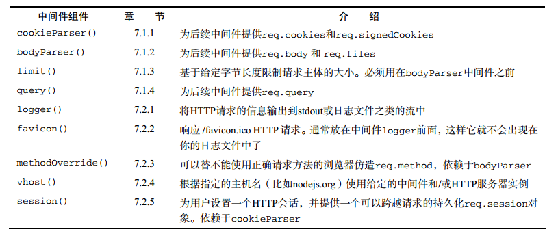
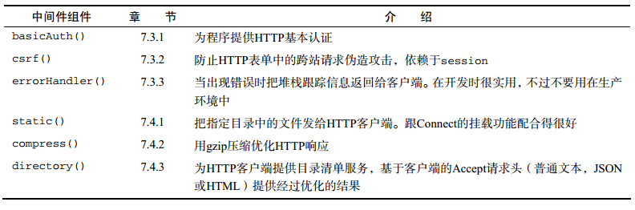

# 1. Connect自带中间件列表
Connect有很多自带中间件，可以满足Web程序开发需要。例如会话管理，cookie解析，请求主体解析，请求日志等。下面的表格中接下来学习的中间件汇总。 
 
 
# 2. 解析cookie,请求体与查询字符串的中间件
Node没有解析cookie,请求体和查询字符串之类的高层Web程序概念的核心模块，因此Connect提供了这些功能的中间件。 
- cookieParser(): 解析来自浏览器的cookie，放到req.cookies中
- bodyParser(): 读取并解析请求体，放入到req.body中
- limit(): 与bodyParser()联手防止读取过大的请求
- query(): 解析请求URL的查询字符串，放到req.qeury中
## 2.1 cookieParser()
cookieParser()支持常规的cookie、签名cookie和特殊的JSON cookie。req.cookies默认是用常规未签名cookie组成的。如果想支持session()中间件要求的签名kookie,在传感cookieParser()实例时要传入一个加密字符串。
