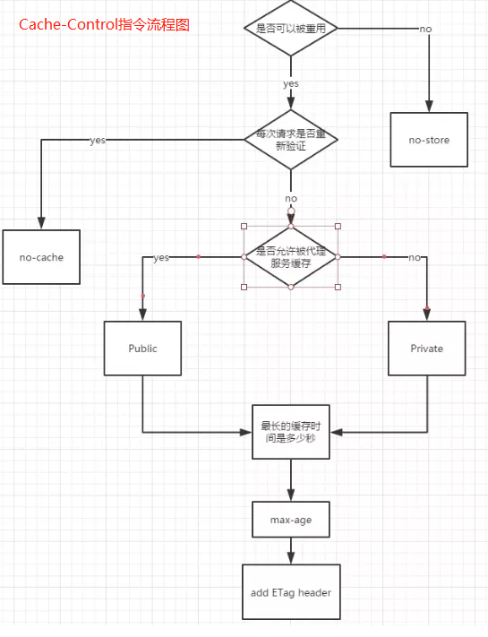
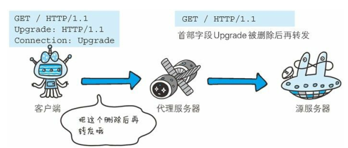
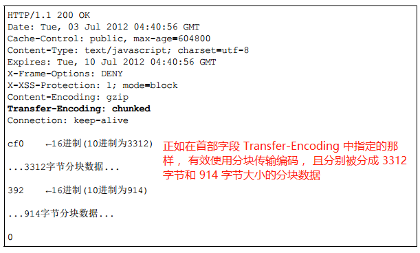
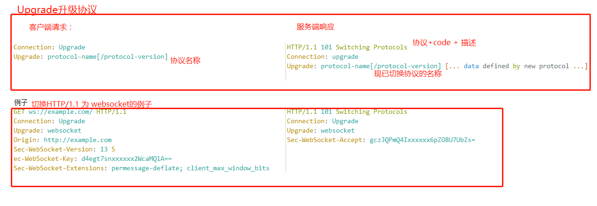
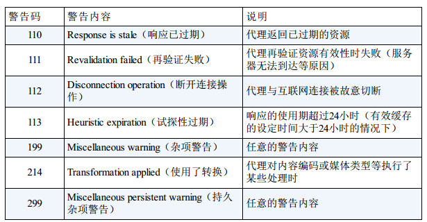

# 1. HTTP 报文
```javascript
HTTP报文 = 报文首部 + '空行（CR+LF）' + 报文主体
```
# 2. HTTP首部字段类型
HTTP首部字段是构成HTTP报文的要素之一。在客户端和服务器端以HTTP协议进行通信的过程中，无论是请求还是响应：都会使用首部字段，它能起到传递额外重要信息的作用。<br>
- 通用首部字段（General Header Fileds）: 请求和响应报文都会使用的首部
- 请求首部字段（Request Header Fields）: 从客户端发起请求时使用。补充了请求的附加内容，客户端信息，响应内容相关优先级。
- 响应首部字段（Response Header Fields）: 从服务端向客户端返回响应报文时使用的首部。补充了响应的附加内容，也会要求客户端附加额外的信息。
- 实体首部字段（Entity Header Fields）: 针对请求报文和响应报文的实体部分使用的首部。补充了资源内容更新时间等于实体有关的信息。<br>

# 3 通用首部字段
<br>
## 3.1 Cache-Control
<br>
```javascript
// 操作缓存的工作机制。参数使用`,`分割
Cache-Control: private, max-age=0, no-cache
```
public : 表明其他用户可以利用缓存<br>

private: 表明只能`特定用户`作为对象（与public相反）。缓存服务器会对特定用户提供缓存的服务，对于其他用户发过来的请求，代理服务器不会返回缓存。<br>

no-cache:从字面意义上很容易误解为不缓存，但是no-cache代表不缓存过期的资源，缓存会向服务器进行有效处理确认之后处理资源<br>
- 客户端请求包含`no-cache`,表示不接受缓存过的响应。
- `中间`缓存服务器必须将客户端`请求`转发给`源服务器`
- `服务器`返回中包含`no-cache`,表明缓存服务器不能对资源进行缓存，并且以后不再对缓存服务器提出的资源有效性进行确认。
- `服务器`返回的`no-cache=Location`,指定了具体参数值，客户端接收到这个`指定参数值的首部字段对应的响应报文后`，不能使用缓存。如果服务器返回的`no-cache`无参数的首部字段是可以缓存的。<br>

no-store: 规定缓存不能再本地存储请求或响应的一部分。<br>

s-maxage(单位秒): `s-maxage`指令的功能和 `max-age` 指令的相同，但`s-maxage`只适用于供多位用户使用的`公共缓存服务器（一般指代理）`，该指令存在会直接接忽略对` Expires 首部字段`及`max-age 指令`的处理。<br>

max-age(单位秒): HTTP/1.1的缓存服务器遇到`max-age`指令，会忽略`Expires`首部，HTTP/1.0下相反<br>
- 当`客户端`发起请求包含`max-age`指令，如果`资源缓存时间`比指定的时间`小`，客户端接收缓存资源。如果`max-age=0`,缓存服务器需要将请求转发给源服务器
- 当`服务端`返回响应包含`max-age`指令，缓存服务器将不对资源有效性进行再次确认，`max-age`代表缓存最长时间<br>

min-fresh(单位秒): 要求缓存服务器返回`小于指定时间`的缓存资源。例如`min-fresh=60`,过了60秒的资源无法作为响应返回。<br>

max-stale(单位秒)：缓存的资源即使`过期`了也照常接收。
- 未指定参数，无论过多久，客户端都会响应
- 指定具体值，那么即使过期，但人处于`max-stale`指定的时间内，仍会被客户端接收。<br>

only-if-cached: 表示客户端 请求资源 仅在`缓存服务器本地 存在缓存`，不需要缓存服务器重新加载响应，也不需要确认资源有效性直接返回，如果`不存在缓存`，则返回状态码`504 Gateway Timeout`。<br>

must-revalidate: 会忽略`max-stale`指令， 代理服务器会向`源服务器`再次验证 请求的响应缓存目前`任然有效`。`代理服务器`连接源服务器异常，返回`504 Gateway Timeout`。执行对象是`被请求`的代理服务器<br>

proxy-revalidate: 要求`所有`的缓存服务器在接收到客户端带有该指令的请求返回响应之前， 必须再次验证缓存的有效性。例如当用户登录，需要所有缓存代理服务器都更新文件，而不是只有被请求的缓存服务器更新。<br>

no-transform: 无论是请求，还是响应，缓存都不能更改实体主体的媒体类型（可防止缓存或代理 去压缩图片等操作）。<br>

cache-extension token: <br>
通过cache-extension 标记(token),可扩展Cache-Control首部字段内的指令。如下：如果缓存服务器不能理解commutity这个新指令，则直接忽略。因此extension tokens 只对能识别它的缓存服务器有效。
```javascript
Cache-Control: private, community="UTC"
```
<br>

## 3.2 Connection
Connection 首部： 控制不再转发给`代理`的首部字段 和  管理持久化连接。<br>
- 客户端发送请求和服务器返回响应 内，使用Connection首部字段，控制不再转发的首部字段（即Hop-by-hop）。<br>
<br>

-  管理持久化连接: HTTP/1.1默认连接是`keep-alive`持久连接，当服务器想明确断开连接，使用`Connection: close`

## 3.3 其他 通用首部字段
首部字段Date: 创建HTTP报文的日期和事件。<br>

Pragma： 仅为兼容历史版本而存在。`Pragma: no-cache` <br>

Trailer: 事先说明在`报文主体后`记录了`哪些首部字段`。 该首部字段可应用在 HTTP/1.1 版本分块传输编码时。<br>
<br>

Transfer-Encoding: 规定传输`报文主体`时采用的`编码方式`。仅对`分块传输`编码有效。<br>
<br>

Upgrade: 用于检测HTTP协议及其他协议是否可使用更高的版本进行通信。<br>
<br>

Via： 在经过代理时附加该首部字段内容。追踪客户端与服务器之前的请求和响应报文的传输路径<br>
- 经常会和 TRACE 方法一起使用。如， 代理服务器接收到由 TRACE 方法发送过来的请求（其中Max-Forwards: 0） 时， 代理服务器就不能再转发该请求了。 这种情况下， 代理服务器会将自身的信息附加到 Via 首部后， 返回该请求的响应。<br>
<br>

Warning: 告知用户一些与缓存相关的警告问题。<br>
```javascript
Warning: [警告码][警告的主机:端口号]“[警告内容]”([日期时间])

Warning: 113 gw.hackr.jo:8080 "something is expiration" Tue 03
```
<br>

# 4. 请求首部字段


q:表示权重，范围0-1，值越大权重越高。Accept-xxx 都可以使用权重来控制。

| 首部字段 | 描述 | 详细参数 |
| :--- | :-- | :------ |
|Accept	|"通知服务器，用户代理能够处理的媒体类型和媒体类型的相对优先级 |type/subtype 格式"	"文本类型：text/html ,text/plain,text/css,application/xhtm+xml,applciation/xml<br>图片文件：image/jpeg,image/gif,image/png<br>视频文件：video/mpeg,video/quicktime<br>应用程序使用的二进制文件：application/octet-stream,application/zip<br>|
| Accept-Charset | 通知服务器用户代理支持的字符集及字符集的相对优先顺序 | Accept-Charset:iso-8895-5,unicode-1-1; |
| Accept-Encoding | 告知服务器用户代理支持的内容编码及内容编码的优先级顺序 | gzip: 由文件压缩程序gzip(GNU zip)生成的编码格式<br>compress: 由UNIX文件压缩程序compress生成的编码格式<br>deflate：组合使用 zlib 格式（RFC1950） 及由 deflate 压缩算法（RFC1951） 生成的编码格式<br>identity: 不执行压缩或不会变化的默认编码格式<br>|
| Accept-Language | 告知服务器用户代理能够处理的自然语言集（指中文或英文等),以及自然语言集的相对优先级 | Accept-Language: zh-cn,zh;q=0.7,en-us,en;q=0.3 | 
| Authorization | 告知服务器， 用户代理的认证信息（证书值）| GET /index.html <br>Ahtorization: Basic dWVub3NlbjpwYXNzd29yZA==<br>|
| Expect | 告知服务器， 期望出现的某种特定行为 | HTTP/1.1 规范只定义了 100-continue（状态码 100 Continue 之意） |
| Form | 告知服务器使用用户代理的用户的电子邮件地址。目的就是为了显示搜索引擎等用户代理的负责人的电子邮件联系方式 | Form: aa@qq.com |
| Host | 同一个IP 服务器部署这多个域名， 使用首部字段 Host 加以区分。| Host: www.hackr.jp |
| Max-Forwards | 以十进制整数形式指定可经过`服务器最大的数目`。<br>通过TRACE 或OPTION 方法，没经过一个服务器`值减1`。<br>当值为`0`时不再转发，直接返回响应 | Max-Forwards：10 |
| Proxy-Authorization | 接收从代理服务器发来的认证查询时，<br>客户端会发送包含首部字段Proxy-Authorization 的请求，<br>以告知服务器认证所需要的信息| Proxy-Authorization: Basic dGlwOjkpNLAGfFY5 |
| Range | 对于只需获取部分资源的范围请求，<br> 包含首部字段 Range 即可告知服务器资源的指定范围 | Range: bytes=5001-10000 |
| Referer | 首部字段 Referer 会告知服务器请求的原始资源的 URI | 
| TE | 告知服务器，客户端能够处理响应的传输编码方式及相对优先级。<br>它和首部字段Accept-Encoding很像，但是用于`传输编码` | TE: gzip,deflate;q=0.5 |
| User-Agent | 用于传达浏览器的种类 | User-Agent: Mozilla/5.0 (Window NT 6.1; wow64;rv:13.0)...|

## If-XXX
附带条件请求：形如`If-xxx`样式的请求首部字段成为`条件请求`。服务器接收到附带条件的请求后，只有判断指定条件为真时，才回执行请求。<br>

| 首部字段 | 描述 | 详细参数 |
| :-- | :-- | :------ |
| If-Match | 只有If-Match的字段值和ETag值匹配，服务器才接受请求 | 客户端请求:<br>Get /Index.html <br>If-Match:'123456' <br><br> 服务器：<br>匹配资源所用的实体标记(ETag)值，一致执行请求返回资源，否则返回状态码412 Precondition Failed <br>If-Match:*,服务器会忽略ETag<br><br>如果需要获取到资源，则在返回状态码412后，还需要再次发起请求`get /index.html`,才能获取到新的资源|
| If-Modified-Since |指定日期时间后，资源费发生了更新，服务端会接收请求。<br>用来确认代理或客户端拥有的本地资源的有效性。 |客户端请求:<br>Get /Index.html <br>If-Modified-Since:Thu,15 Apr 2012 00:00:00 GMT <br><BR> 服务端：<br>有修改返回：200 ok <br> Last-Modified: Sun,29 Aug 2012 00:00:12 GMT <br> 无修改返回 304 Not Modified |
| If-None-Match | 只有在 If-None-Match 的字段值与 ETag 值不一致时， 可处理该请求。<br>如果一致，就返回304，表示告知客户端使用自己本地的缓存。<br>在 GET 或 HEAD 方法中使用首部字段 If-None-Match 可获取最新的资源。<br>因此，这与使用首部字段 If-Modified-Since 时有些类似 |客户端请求:<br>Get /Index.html <br>If-None-Match: '123456'<br><BR> 服务端：<br>ETag不一致：服务端处理，返回最新的数据 <br> 一致则返回304，客户端使用自己本地缓存 |
| If-Range | 告知服务器若指定的 IfRange 字段值(ETag 值或者时间)<br>和请求资源的`ETag`值或时间相一致时,则作为范围请求处理。<br>反之，则返回全体资源 | 客户端:<br> GET /index.html <br>If-Range:'123456'<br>Range: byte=5001-10000<br><br> 服务端 ETag=123456：<br> 206 Partial Content <br> Content-Range: bytes 5001-10000/10000<br>Content-Length:5000<br><br> 服务器 ETag=567890:<br> 200 OK <br>ETag: '567890' |
| If-Unmodified-Since | 告知服务器，请求的资源在字段值指定的日期之后，未发生更新的请求才处理请求。<br>如果指定日期后发生了更新，则以状态码412 Preconditino Failed 响应 | 客户端：<br>Get /index.html <br>If-Unmodified-Since:Thu,15 Apr 2012 00:00:00 GMT<br> <br>服务端时间内无修改：<br>200 ok  <br><br> 服务端时间内有修改：<br> 412 Precondition Failed|


# 5. 响应首部字段

| 首部字段 | 描述 | 详细参数 |
| :-- | :-- | :------ |
| Accept-Ranges | 告知客户端，服务器端是否能够处理范围请求，以指定获取服务器端某个部分的资源 | Accept-Ranges:bytes/none (none表示不能处理) |
| Age | 告诉客户端，源服务器在多久前创建了响应。单位`秒`。<br>若创建该响应的服务器是缓存服务器， Age 值是指缓存后的响应再次发起认证到认证完成的时间值。 <br>代理创建响应时必须加上首部字段Age。 | Age:600 |
| ETag | 它是一种可将`资源以字符串`形式做唯一性标识的方式。服务器会为每份资源分配对应的 ETag 值。<br>当资源更新时，ETag 值也需要更新。生成 ETag 值时，并没有 统一的算法规则，而仅仅是由服务器来分配<br><br>资源被缓存时，就会被分配唯一性标识。ETag 中有强 ETag 值和弱 ETag 值之分：<br>-强 ETag 值: 不论实体发生多么细微的变化都会改变其值。`ETag: "usagi-1234"`<br>-弱 ETag 值: 只用于提示资源是否相同。只有资源发生了根本改变，产 生差异时才会改变 ETag 值。这时，会在字段值最开始处附加 W/。`ETag: W/"usagi-1234"`<br>| `ETag: "usagi-1234"`|
| Location | 将响应接收方引导至某个与请求 URI 位置不同的资源<br>一般配合`3xx：Redirection`，提供重定向URI,浏览器会强制性尝试访问重定向资源<br>|Location: http://www.xxx.com|
| proxy-Authenticate | 会把由代理服务器所要求的认证信息发送给客户端 | Proxy-Authenticate: Basic realm="Usagidesign Auth" |
| Retry-After | 告诉客户端应该多久之后再次发起请求，配合状态码`503 Service Unavailable`或`3xx Redirect` | Retry-After:120(单位秒),Retry-After:Wed 04 Jul 2012 06:32:23 GMT|
| Server| 告知客户端，当前服务器上安装的HTTP服务器应用程序的信息 | Server: Apache/2.2.6 (Unix) PHP/5.2.5 |
| WWW-Authenticate | 用于 HTTP 访问认证。 它会告知客户端用于访问请求 URI 所指定资源的认证方案（Basic 或是 Digest） 和带参数提示的质询（challenge） 。 状态码 401 Unauthorized 响应中，肯定带有首部字段 WWW-Authenticate ||
| Vary | 首部字段Vary可对缓存进行控制，源服务器 向 代理服务器传达关于本地返还使用方法的命令:<br>-代理服务器收到源服务器Vary:Accept-Language,若要进行缓存，则只缓存Accept-Language中可接受的语言的对应的文件进行缓存（en：则缓存英文）。<br>如果缓存服务器的缓存资源和Vary指定的首部字段不同，则需要重新冲源服务器中获取| Vary: Accept-Language |
# 6. 实体首部字段

| 首部字段 | 描述 | 详细参数 |
| :-- | :-- | :------ |
| Allow | 用于通知客户端能够支持 Request-URI 指定资源的所有 HTTP 方法 | Allow: GET,HEAD|
| Content-Encoding|告知客户端服务器对实体的主体部分选用的内容编码方式 | Content-Encoding: gzip |
| 
# 8. End-to-end 首部和Hop-by-hop首部
HTTP首部字段将定义`缓存代理`和`非缓存代理`的行为。<br>

`逐跳首部(Hop-by-hop Header)`: 该类首部支队单次转发有效，会因通过缓存或代理而不再转发。HTTP/1.1后如果要使用`Hop-by-hop`首部，需提供Connection首部字段。<br>
- Connection
- Keep-Alive
- Proxy-Authenticate
- Proxy-Authorization
- Trailer
- TE
- Transfer-Encoding
- Upgrade<br>

`端到端首部(End-to-end Header)`: 除上面的`逐跳首部`，都属于该类。分到该类的首部`会转发给请求` / `响应对应的最终接收目标`，且必须`保存`在由`缓存生成的响应中`，另外规定它`必须被转发`。

# 8. 非HTTP/1.1首部字段
- Cookie
- set-Cookie
- Content-Disposition
